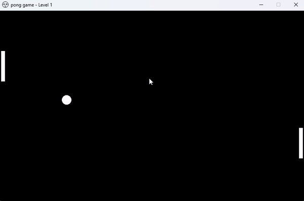
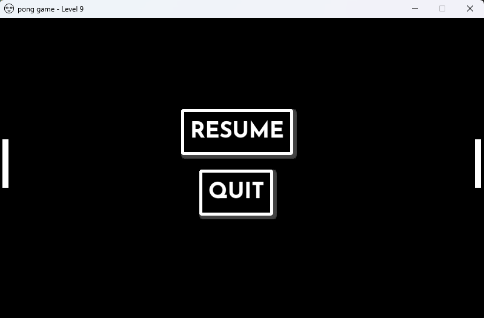
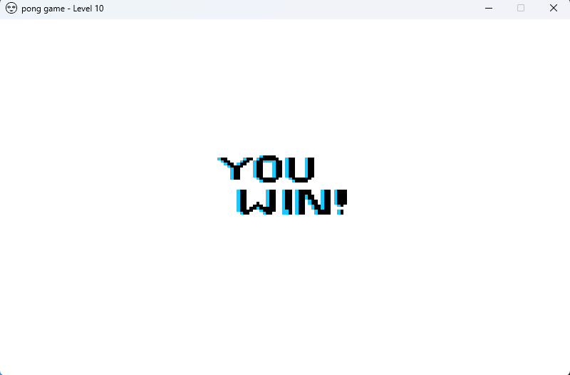
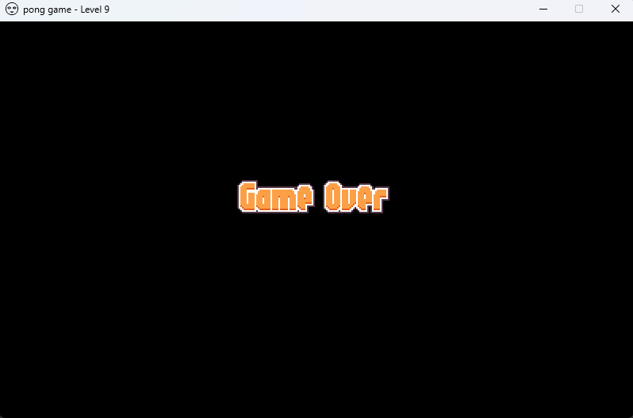

# Pong Game

*Pong game* is based on [*pong*](https://pt.wikipedia.org/wiki/Pong) developed by Atari in 1972.
But different from original, I decided that both players (or just you), will work together to reach level 10, while the game speed increases constantly each level.

### Tecnologies:

- Python
- Library Pygame

### More about the game:

The game is very simple, there's one bar in each side of the screen that can't let the ball that bounces on screen top and bottom pass them. Here is a visual demonstration from a gameplay.

<p align='center'>
  
</p>

From this GIF you can see that the level indicator is on the window caption and not much more than that.
#
But there's more, I added a little menu so you can pause the game.

<p align='center'>
  
</p>

From here you can continue to play or just quit game.
#
And last but not least, both screen's: <br/>

*Win screen*, which is displayed as soon as you reach level 10.
<p align='left'>
  
</p>
<p align='right'>And <i>Game Over</i> screen, which is displayed after the ball reaches the left or right side of the screen.</p>
<p align='right'>
  
</p>

### How to play:

* Clone this repository with ```git clone git@github.com:RicardoSouza03/Pong-Game.git```
* Access the folder with the game files ```cd pong_game```
* After that I advise that you create a virtual enviroment with venv and inside this enviroment you can use ```python3 -m pip install -r dev-requirements.txt```
* And now you can run the file *my_game* and play it.

To control the bars you have to use *W* and *S* to the left bar and *ArrowUp* and *ArrowDown* to the right bar.

#
> Made by: [Ricardo Souza](https://github.com/RicardoSouza03) - 2023©
